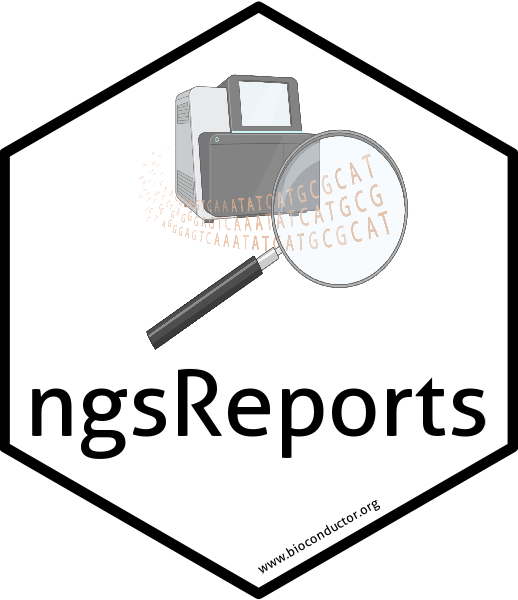

# ngsReports 

<!-- badges: start -->
[](https://github.com/smped/ngsReports/actions)
[](https://shields.io/)
[](https://codecov.io/gh/smped/ngsReports?branch=gh-actions)
<!-- badges: end -->


An R Package for managing FastQC reports and other NGS related log files inside R.
Except for some periodic minor bug fixes, this branch is the current release which is also available from [the Bioconductor website](https://bioconductor.org/packages/release/bioc/html/ngsReports.html).

## Installation

To install required packages follow the instructions below.

```
install.packages("BiocManager")
BiocManager::install("ngsReports")
library(ngsReports)
```

## Usage 
The paper for the package can be found [here](https://doi.org/10.1093/bioinformatics/btz937). 
For a detailed usage guide please see [here](https://bioconductor.org/packages/release/bioc/vignettes/ngsReports/inst/doc/ngsReportsIntroduction.html).

## ShinyApp

A Graphical User Interface (Shiny App) has been developed for interactive inspection of many FastQC reports. The ngsReports shiny app can be installed [here](https://github.com/UofABioinformaticsHub/shinyNgsReports).

## Tools Supported (By Category)

### Quality control
- FastQC
- fastp


### Adapter removal and trimming
- AdapterRemoval
- cutadapt
- trimmomatic
- fastp

### Deduplication
- umi_tools dedup

### Mapping and alignment 
- bowtie
- bowtie2
- hisat2
- macs2 callpeak
- picard MarkDuplicates
- rnaseqc
- samtools flagstat
- STAR

### Transcript/gene quantificaiton
- feature counts (Subread)

### Genome assembly
- BUSCO
- quast

# Citation 

Please cite our [paper](https://doi.org/10.1093/bioinformatics/btz937):

```
@article{ward2018ngsreports,
    author = {Ward, Christopher M and To, Thu-Hien and Pederson, Stephen M},
    title = "{ngsReports: a Bioconductor package for managing FastQC reports and other NGS related log files}",
    journal = {Bioinformatics},
    year = {2019},
    month = {12},
    doi = {10.1093/bioinformatics/btz937},
    url = {https://doi.org/10.1093/bioinformatics/btz937}
}
```
